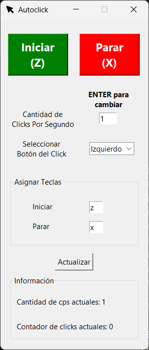

# Autoclick Español

Autoclick hecho con fines de aprendizaje, requiere tener un interpretardor de python y un IDE instalado, unas cuantas dependencias y listo. A disfrutar!


## Dependencias
- keyboard

- pyautogui
## Instalación

Clona el repositorio.

```bash
  git clone https://github.com/Norigamin/Autoclick_Español.git
```

Instala las dependencias para poder usarlo.

```bash
  pip install -r requirements.txt
```
Inicia el archivo autoclick.py y listo.
    
## Demostración



## Autores

- [@Norigamin](https://github.com/Norigamin)

